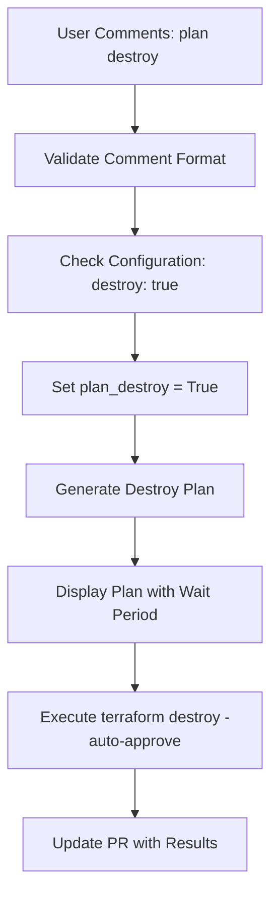
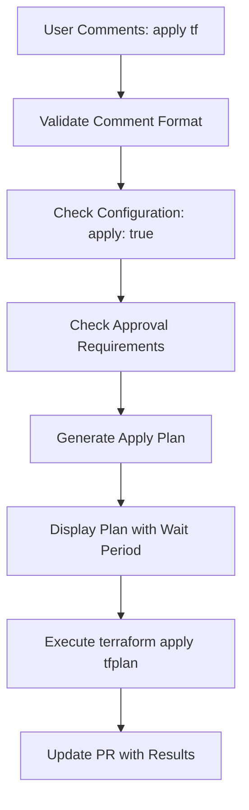
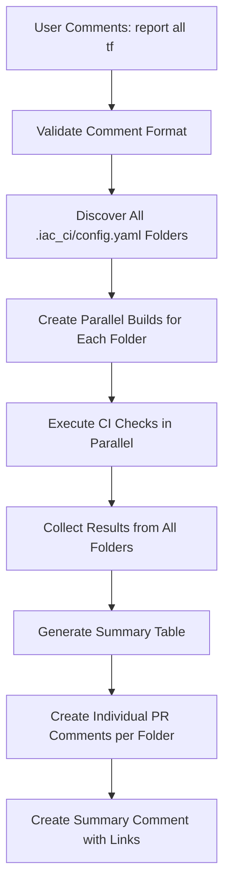

# Infrastructure as Code CI/CD - Common Operations Flow

This document provides detailed information about the three main operations in the iac-ci system: **Destroy**, **Apply**, and **Report All TF**.

## Table of Contents

1. [Destroy Operations](#destroy-operations)
2. [Apply Operations](#apply-operations)
3. [Report All TF Operations](#report-all-tf-operations)
4. [Safety Measures](#safety-measures)
5. [Configuration Requirements](#configuration-requirements)

---

## Destroy Operations

### Overview
Destroy operations are used to tear down infrastructure resources managed by Terraform. This is a critical operation that requires explicit configuration and user confirmation.

### Trigger Conditions

#### 1. Comment-Based Trigger
**Comment Format**: `plan destroy <check_string>` or `check destroy <check_string>`

**Example**:
```
plan destroy confirm
check destroy destroy_my_infra
```

**Location**: `src/main_webhook.py` lines 708-713

#### 2. Configuration Requirements
- **File**: `.iac_ci/config.yaml`
- **Setting**: `destroy: true` must be explicitly set
- **Validation**: System checks this setting before allowing destroy operations

### Destroy Execution Flow



### Detailed Steps

#### Step 1: Comment Processing
- **File**: `src/main_webhook.py`
- **Method**: `_eval_iac_action()`
- **Validation**: Comment must match configured `destroy_str` in database
- **Result**: Sets `self.plan_destroy = True`

#### Step 2: Plan Generation
- **File**: `src/iac_ci/helper/resource/terraform.py`
- **Method**: `get_tf_plan_destroy()`
- **Commands**:
  ```bash
  terraform init
  terraform validate
  terraform plan -destroy
  ```

#### Step 3: Safety Review
- **Wait Period**: 120 seconds (configurable via `wait_destroy`)
- **Display**: Shows destroy plan with clear formatting
- **Location**: `src/iac_ci/helper/resource/terraform.py` lines 333-338

#### Step 4: Execution
- **Method**: `get_tf_destroy()`
- **Command**: `terraform destroy -auto-approve`
- **Location**: `src/iac_ci/helper/resource/terraform.py` line 341

### Safety Measures for Destroy

1. **Configuration Gate**: Requires `destroy: true` in config
2. **Comment Validation**: Must match exact format and check string
3. **Wait Period**: 120-second pause for review
4. **Plan Display**: Shows exactly what will be destroyed
5. **Auto-approve**: Only after all validations pass

---

## Apply Operations

### Overview
Apply operations deploy infrastructure changes using Terraform. This is the primary deployment mechanism for infrastructure updates.

### Trigger Conditions

#### 1. Comment-Based Trigger
**Comment Format**: `apply tf <check_string>`

**Example**:
```
apply tf deploy
apply tf production
```

**Location**: `src/main_webhook.py` lines 749-790

#### 2. Configuration Requirements
- **File**: `.iac_ci/config.yaml`
- **Setting**: `apply: true` must be explicitly set
- **Approval**: May require PR approval depending on configuration

### Apply Execution Flow



### Detailed Steps

#### Step 1: Comment Processing
- **File**: `src/main_webhook.py`
- **Method**: `_eval_iac_action()`
- **Validation**: Comment must match configured `apply_str` in database
- **Approval Check**: Verifies PR approval if `require_approval` is enabled

#### Step 2: Plan Generation
- **File**: `src/iac_ci/helper/resource/terraform.py`
- **Method**: `get_tf_ci()` for plan, `get_tf_apply()` for execution
- **Commands**:
  ```bash
  terraform init
  terraform validate
  terraform plan -out=tfplan
  ```

#### Step 3: Safety Review
- **Wait Period**: 30 seconds (configurable via `wait_apply`)
- **Display**: Shows apply plan with clear formatting
- **Location**: `src/iac_ci/helper/resource/terraform.py` lines 311-318

#### Step 4: Execution
- **Method**: `get_tf_apply()`
- **Command**: `terraform apply tfplan`
- **Location**: `src/iac_ci/helper/resource/terraform.py` line 321

### Apply Safety Measures

1. **Configuration Gate**: Requires `apply: true` in config
2. **Comment Validation**: Must match exact format and check string
3. **Approval Check**: May require PR approval
4. **Wait Period**: 30-second pause for review
5. **Plan Display**: Shows exactly what will be applied

### Apply vs Destroy Differences

| Aspect | Apply | Destroy |
|--------|-------|---------|
| Wait Time | 30 seconds | 120 seconds |
| Command | `terraform apply tfplan` | `terraform destroy -auto-approve` |
| Plan Command | `terraform plan -out=tfplan` | `terraform plan -destroy` |
| Risk Level | Medium | High |

---

## Report All TF Operations

### Overview
Report All TF operations provide comprehensive analysis across multiple Terraform directories. This is used for multi-folder repositories to get a unified view of all infrastructure changes.

### Trigger Conditions

#### 1. Comment-Based Trigger
**Comment Format**: `report all tf <check_string>`

**Example**:
```
report all tf analyze
report all tf status
```

**Location**: `src/main_webhook.py` lines 714-725

### Report All TF Execution Flow



### Detailed Steps

#### Step 1: Comment Processing
- **File**: `src/main_webhook.py`
- **Method**: `_eval_iac_action()`
- **Result**: Sets `self.report_folders = 'all'`

#### Step 2: Folder Discovery
- **File**: `src/main_webhook.py`
- **Method**: `_exec_report_folders()`
- **Process**: Scans repository for all directories containing `.iac_ci/config.yaml`
- **Result**: Creates list of folders to analyze

#### Step 3: Parallel Build Creation
- **File**: `src/main_webhook.py`
- **Method**: `_save_run_info()`
- **Process**: Creates individual run records for each folder
- **Result**: `parallel_folder_builds` array with run IDs

#### Step 4: Parallel Execution
- **File**: `src/main_lambda.py`
- **Method**: `_exec_in_aws()`
- **Process**: Each folder runs independently with method="report"
- **Commands**: Same as CI checks (init, validate, plan, tfsec, infracost)

#### Step 5: Results Aggregation
- **File**: `src/main_pr.py`
- **Method**: `_exec_parallel_runs()`
- **Process**: Collects results from all parallel runs
- **Analysis**: Generates summary data for each folder

#### Step 6: PR Comment Generation
- **File**: `src/main_pr.py`
- **Method**: `_get_pr_md_parallel_runs()`
- **Output**: 
  - Individual detailed comment per folder
  - Summary table with drift, security, and cost indicators
  - S3 links to all artifacts

### Report All TF Output

#### Summary Table
```
| Folder | Drift Check | Security | Cost |
|--------|------------|----------|------|
| [folder1](link) | ✅ | ✅ | $50.00 |
| [folder2](link) | 🔴 | ⚠️ | $75.00 |
```

#### Individual Folder Reports
Each folder gets its own detailed comment containing:
- **Terraform Plan**: With drift analysis
- **Security Scan**: TFSec results with severity indicators
- **Cost Analysis**: Infracost monthly cost estimates
- **S3 Links**: Direct links to all artifacts

#### Legend
- **Drift**: 🔴 Yes | ✅ No
- **Security**: ❌ High | ⚠️ Medium | ℹ️ Low | ✅ Success

### Report All TF Benefits

1. **Multi-Folder Support**: Analyzes entire repository at once
2. **Parallel Execution**: Fast processing of multiple directories
3. **Unified View**: Single summary with individual details
4. **Comprehensive Analysis**: Plan, security, and cost for each folder
5. **Artifact Links**: Direct access to all generated reports

---

## Safety Measures

### Universal Safety Features

1. **Configuration Validation**: All operations require explicit enablement
2. **Comment Format Validation**: Must match exact patterns
3. **Wait Periods**: Built-in delays for human review
4. **Plan Display**: Clear visualization of changes before execution
5. **Error Handling**: Comprehensive error reporting and rollback

### Operation-Specific Safety

#### Destroy Safety
- **Longest Wait Period**: 120 seconds
- **Explicit Configuration**: `destroy: true` required
- **Clear Warnings**: Prominent display of what will be destroyed

#### Apply Safety
- **Approval Requirements**: Optional PR approval gate
- **Plan Review**: Shows changes before application
- **Moderate Wait**: 30 seconds for review

#### Report Safety
- **Read-Only**: No infrastructure changes
- **Parallel Isolation**: Each folder runs independently
- **Comprehensive Logging**: Full audit trail

---

## Configuration Requirements

### Repository Setup

1. **Configuration File**: `.iac_ci/config.yaml` in each directory
2. **Required Settings**:
   ```yaml
   destroy: true    # Enable destroy operations
   apply: true      # Enable apply operations
   ```

### Database Configuration

1. **Action Strings**: Configured in DynamoDB
   - `destroy_str`: "destroy tf"
   - `apply_str`: "apply tf"
   - `check_str`: "check tf"

2. **Approval Settings**:
   - `require_approval`: Boolean flag for apply operations

### Environment Variables

1. **Wait Periods**:
   - `wait_destroy`: Destroy wait time (default: 120s)
   - `wait_apply`: Apply wait time (default: 30s)

2. **Security**:
   - `INFRACOST_API_KEY`: For cost analysis
   - GitHub token for PR operations

---

## Best Practices

### For Destroy Operations
1. **Always review the plan** during the 120-second wait period
2. **Use descriptive check strings** to prevent accidental execution
3. **Test in non-production environments** first
4. **Coordinate with team** before destroying shared resources

### For Apply Operations
1. **Review changes carefully** before commenting
2. **Use feature branches** for testing
3. **Monitor the 30-second wait period** for any issues
4. **Verify apply results** in the PR comments

### For Report All TF
1. **Use for comprehensive analysis** of multi-folder repositories
2. **Review individual folder reports** for detailed information
3. **Check the summary table** for quick overview
4. **Use S3 links** to access detailed artifacts

---

## Troubleshooting

### Common Issues

1. **"Not Allowed" Error**: Check `.iac_ci/config.yaml` settings
2. **Comment Not Recognized**: Verify exact format and check string
3. **Approval Required**: Ensure PR is approved if `require_approval` is enabled
4. **Timeout Issues**: Check wait period configurations

### Debug Information

1. **Enable Debug Mode**: Set `DEBUG_IAC_CI=true`
2. **Check Logs**: Review CloudWatch logs for detailed execution info
3. **S3 Artifacts**: All plans and results are stored in S3
4. **PR Comments**: Detailed error messages in PR comments

---

This comprehensive guide covers all three main operations in the iac-ci system. Each operation is designed with safety, transparency, and comprehensive reporting in mind, ensuring reliable infrastructure management through code.
