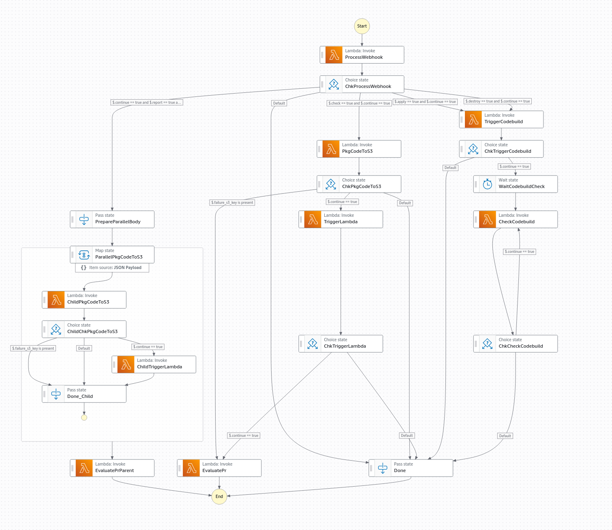
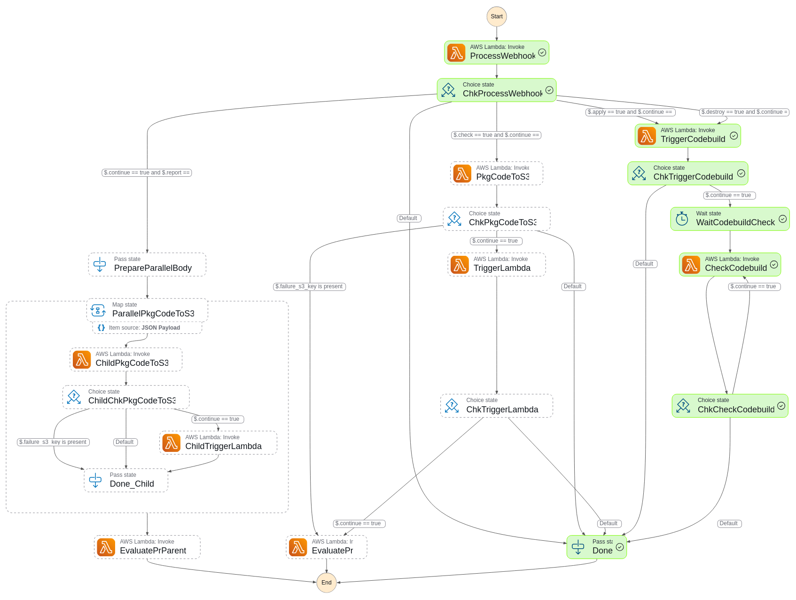
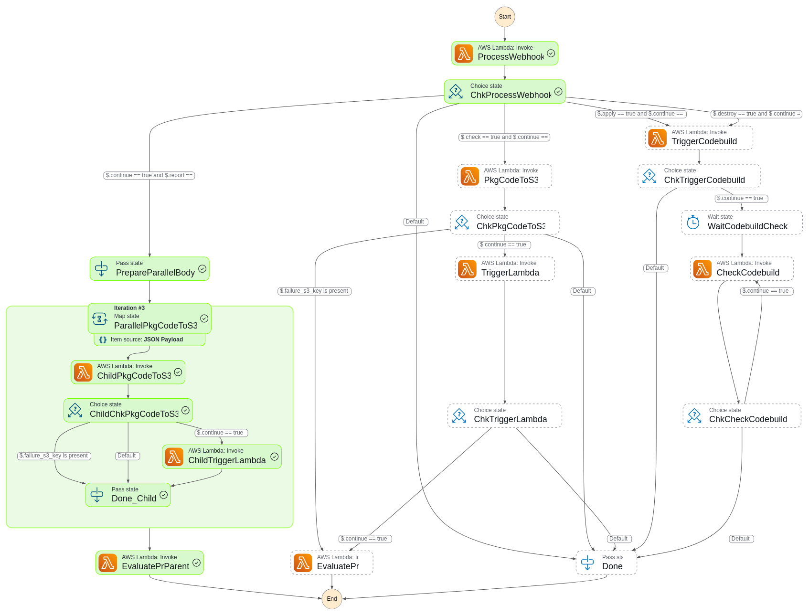
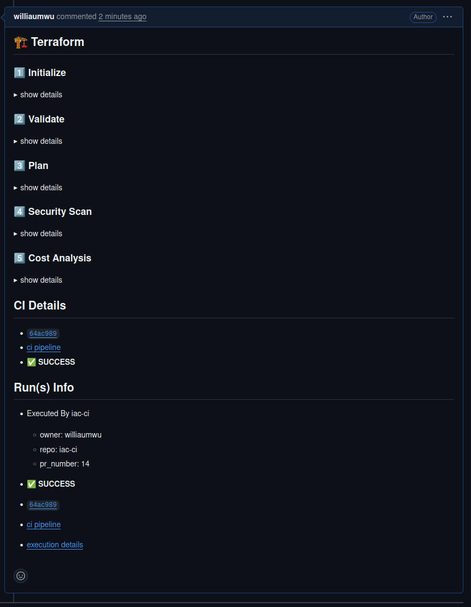
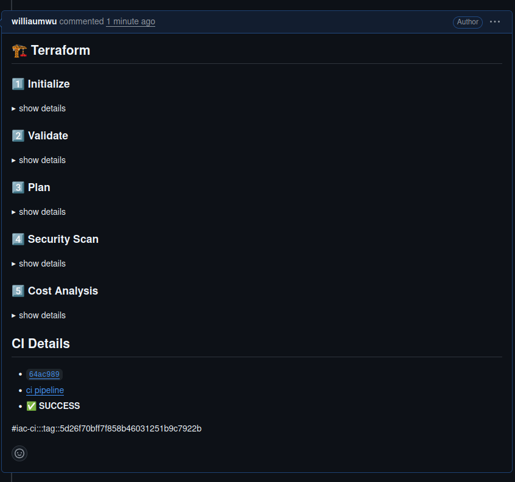
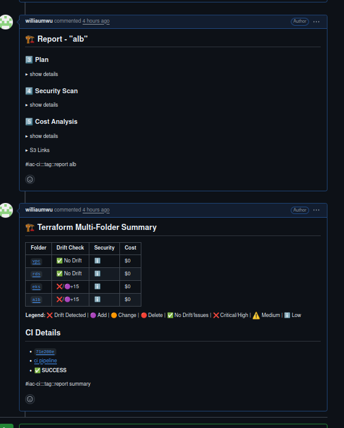
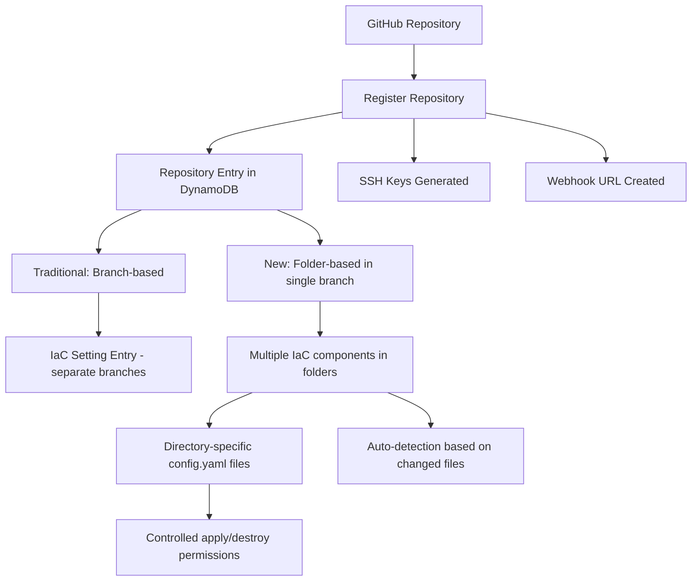

# What is "iac-ci"?

"iac-ci" is a standalone system built on AWS that provides continuous integration for Infrastructure as Code (IaC). It serves as an alternative to Atlantis, offering several key benefits:

- **Open Source**: Fully belongs to the open-source community.
- **24/7 Availability**: Users can install it and have it running around the clock.
- **Cost-Effective**: Pay only for what you use.
- **No Scaling Concerns**: No need to manage and scale runners or workers.
- **No Third-Party API Gateway**: Eliminates the need for external services to manage APIs.

## How It Works

"iac-ci" system utilizes:

- **Two DynamoDB Tables**:
  - `iac-ci-settings`: Stores permanent configuration settings for each registered GitOps repository for IaC.
  - `iac-ci-runs`: A temporary table that records CI runs.

- **Lambda Functions**: Several Lambda functions are interconnected in a pipeline managed by a Step Function called `iac-ci-stepf-ci`.

- **API Gateway**: Acts as an entry point to receive webhooks.

"iac-ci" relies on executors:
- **"iac-ci" lambda executor**: Lambda function with elevated privileges to execute the IAC code
- **"iac-ci" codebuild project executor**: Codebuild project with elevated privileges to execute IAC apply/destroy

### Step Function Workflow

The core of iac-ci is an AWS Step Function that orchestrates the entire workflow based on the type of request:

[](images/stepfunction-diagram.png)

### Process Workflow (Abbreviated)

<pre>
                     <span style="color: teal;">+---------------------+</span>
                     <span style="color: teal;">|     API Gateway     |</span>
                     <span style="color: teal;">|  <span style="color: white;">(Receives Webhook)</span> |</span>
                     <span style="color: teal;">+----------+----------+</span>
                    <span style="color: green;">           |</span>
                    <span style="color: green;">           v</span>
                <span style="color: teal;">+-------------------------------+</span>
                <span style="color: teal;">|  iac-ci-lambda_trigger_stepf  |</span>
                <span style="color: teal;">|    <span style="color: white;">(Triggers Step Function)</span>   |</span>
                <span style="color: teal;">+---------------+---------------+</span>
                <span style="color: green;">                |</span>
                <span style="color: green;">                v</span>
                <span style="color: teal;">+-------------------------------+</span>
                <span style="color: teal;">|     iac-ci-process_webhook    |</span>
                <span style="color: teal;">| <span style="color: white;">      (Validates Webhook)</span>     |</span>
                <span style="color: teal;">+---------------+---------------+</span>
    <span style="color: green;">                            |</span>
<span style="color: green;">             +---------------------------------+</span>
<span style="color: green;">             |                                 |</span>
<span style="color: green;">             v                                 v</span>
<span style="color: teal;">+----------------------------+    +----------------------------+</span>
<span style="color: teal;">|           CD Run           |    |          CI Run            |</span>
<span style="color: teal;">|     <span style="color: white;">(TF apply/destroy)</span>     |    | <span style="color: white;"> (TF plan/Tfsec/Infracost)</span> |</span>
<span style="color: teal;">+----------------------------+    +----------------------------+</span>
<span style="color: green;">             |                                 |</span>
<span style="color: green;">             v                                 v</span>
<span style="color: teal;">+----------------------------+    +----------------------------+</span>
<span style="color: teal;">|   iac-ci-trigger_codebuild |    |      iac-ci-pkg_to_s3      |</span>
<span style="color: teal;">|     <span style="color: white;">(Triggers Build)</span>       |    |  <span style="color: white;">(Pkg Code & Upload to s3)</span> |</span>
<span style="color: teal;">+----------------------------+    +----------------------------+</span>
       <span style="color: green;">      |                                 |</span>
       <span style="color: green;">      v                                 v</span>
<span style="color: teal;">+----------------------------+    +----------------------------+</span>
<span style="color: teal;">|    iac-ci-check_codebuild  |    |    iac-ci-trigger_lambda   |</span>
<span style="color: teal;">|      <span style="color: white;">(Monitors Build)</span>      |    |      <span style="color: white;">(Executes CI Run)</span>     |</span>
<span style="color: teal;">+----------------------------+    +----------------------------+</span>
               <span style="color: green;">      |                   |</span>
               <span style="color: green;">      v                   v</span>
              <span style="color: teal;">+-------------------------------+</span>
              <span style="color: teal;">|         iac-ci-update_pr      |</span>
              <span style="color: teal;">| <span style="color: white;">(Updates PR & Slack Notify)</span>   |</span>
              <span style="color: teal;">+-------------------------------+</span>
</pre>

1. **Webhook Reception**: The API Gateway receives a webhook.
2. **Triggering Step Function**: The API Gateway forwards the webhook to a Lambda function, `iac-ci-lambda_trigger_stepf`, which triggers the Step Function `iac-ci-stepf` with the webhook payload.
3. **Processing the Webhook**:
   - The first Lambda function in the Step Function, `iac-ci-process-webhook`, checks if the webhook is valid by matching it against entries in the `iac-ci-settings` DynamoDB table.
   - It processes only specific webhook types: push, pull request, or PR comments; all others are ignored.
   - If the webhook is valid, `iac-ci-process-webhook` determines whether it's a general CI run OR a Terraform apply/destroy action.
     - **For Apply or Destroy**:
       - The function passes the webhook information to `iac-ci-trigger_codebuild`.
       - `iac-ci-trigger_codebuild` triggers the specified CodeBuild project (e.g., `iac-ci`) with elevated privileges to execute the IaC code and update the cloud infrastructure.
       - The next function, `iac-ci-check_codebuild`, monitors the progress of the IAC execution in the Codebuild project.
       - Once the Apply/Destroy is finishes, `iac-ci-check_codebuild` summarizes the build results and updates the PR comment if applicable, also posting summary links to a designated Slack channel.
     - **For CI Run**:
       - The function passes the webhook information to `iac-ci-pkg_to_s3`, which packages the correct code repository and uploads it to a temporary S3 bucket with automatic expiration.
       - Once packaged, `iac-ci-trigger_lambda` activates a Lambda function (e.g., `iac-ci`) to execute the CI run for IaC.
       - After completion, the `iac-ci-update_pr` function updates the PR and notifies users through Slack.
     - **For Comprehensive Report**:
       - The system uses a Map state to execute parallel processes for each folder configured with `.iac_ci/config.yaml`
       - Each folder is individually packaged and processed
       - Results are collected and a comprehensive report is generated

## Sample Screenshots

Below are visual examples that demonstrate how different iac-ci operations appear in the AWS console and PR comments. Click on any image to view it in full size:

### AWS Console Examples

#### Apply Operation
[](images/sample-apply.png)

#### Destroy Operation
[](images/sample-destroy.png)

#### Check Operation
[](images/sample-check-image.png)

#### Report All Operation
[](images/sample-report-all.png)

### PR Comment Examples

#### Apply/Destroy Operation in PR
[](images/sample-apply_or_destroy-tf-pr.png)

#### Check Operation in PR
[](images/sample-check-tf-pr.png)

#### Report All Operation in PR
[](images/sample-report-all-tf-pr.png)

These screenshots provide a concrete understanding of the execution flow and output format for each operation type, helping users become familiar with the system before using it. The PR comment examples show how iac-ci provides summaries with links to CI pipelines, CodeBuild runs, and detailed reports directly in your pull requests.

## Folder-Based Workflow

iac-ci now supports a folder-based workflow that allows you to organize multiple IaC components within a single branch. This approach offers a simplified management experience while maintaining control over your infrastructure.

### Directory Configuration and Auto-Detection

Each IaC directory must include a `.iac_ci/config.yaml` file that explicitly defines what operations are permitted for that specific infrastructure component. 

#### Important Autodetection Mechanism

iac-ci uses an autodetection mechanism to determine which IaC components to process:

1. When a PR is created or updated, iac-ci examines which files have changed
2. It identifies which directories contain those changed files
3. It checks if any of these directories contain a `.iac_ci/config.yaml` file
4. **Only directories with changes AND a config file will be processed**

**Critical Caveat**: For actionable items (apply, destroy, check, plan destroy), there **must be changes** in the specific directory for iac-ci to detect and process that directory. If no files have changed in a directory, iac-ci will not take action on that directory, even if it has a config file.

The only exception is the `report all tf` command, which will run comprehensive checks on all folders with a `.iac_ci/config.yaml` file, regardless of whether they have changes in the current PR.

### Example Configuration Files

For a VPC component that can be checked and applied, but not destroyed:
```yaml
# vpc/.iac_ci/config.yaml
apply: true
```

For a development VM that can be checked, applied, and destroyed:
```yaml
# dev-vm/.iac_ci/config.yaml
apply: true
destroy: true
```

### Running Commands

iac-ci provides two main categories of commands:

#### 1. Checks/Preflight (Available for directories with changes)
For directories with a `.iac_ci/config.yaml` file AND changes in the PR:
- **check tf**: Validates Terraform configuration
- **plan destroy tf**: Plans destruction to evaluate impact

#### 2. Actionable Items (Configured Per Directory)
Operations that modify infrastructure require:
1. The directory must have changes in the current PR
2. The directory must have a `.iac_ci/config.yaml` file with explicit permission
   - **apply tf**: Requires `apply: true` in the config file
   - **destroy tf**: Requires `destroy: true` in the config file

#### 3. Comprehensive Reporting
- **report all tf**: Special command that runs checks on ALL directories with `.iac_ci/config.yaml`, regardless of whether they have changes in the current PR

### Single Branch with Multiple Folders Approach

This approach allows you to:
- Organize all your IaC code in a folder structure within a single branch (e.g., "main")
- Register this branch with iac-ci
- Create PRs back to this single branch for individual IaC component changes

**Important Constraint**: iac-ci will only process PRs containing changes to a single IaC component. If multiple IaC components are modified in a single PR, iac-ci will intentionally not process it. This ensures controlled and focused changes to your infrastructure.

#### Pros
- **Ease of use**: Simplified management of IaC components
- **Comprehensive reporting**: All IaC code can be reported in a single PR
- **Team efficiency**: Works best with small teams where managing multiple repositories and branches would require too much overhead
- **Granular control**: Per-directory configuration allows precise control over what operations are permitted for each component

#### Cons
- **Less isolation**: Components share the same branch
- **Reduced standardization**: Less alignment with the practice of distributing Terraform code into small, isolated repositories

## Installation

The easiest way to install the "iac-ci" system is through [config0.com](https://www.config0.com). You simply need to sign up and execute two workflows. However, you will still need to complete all manual prerequisites, such as:

- Generating a GitHub token
- Obtaining an Infracost API token
- Creating a Slack app and getting the Webhook URL

Alternatively, you can install the system manually.
- Details: [Install "iac-ci" system manually](docs/INSTALL.md).
 
## Repository Management

"iac-ci" offers flexible repository management options:

### 1. Repository Registration
Each GitHub repository must be registered once with the "iac-ci" system. This creates:
- **Unique webhook endpoint** for the repository
- **Repository-specific SSH keys** for secure access
- **DynamoDB entry** with `type: "registered_repo"`

### 2. IaC Configuration Options

#### Branch-Based Approach (Traditional)
- Track different branches for specific IaC configurations
- **Limitation**: Only one IaC configuration per branch is supported

#### Folder-Based Approach (New)
- Organize multiple IaC components in folders within a single branch
- Configure each directory with its own `.iac_ci/config.yaml` file
- Create separate PRs for each component
- Control which operations (apply/destroy) are permitted per directory
- **Remember**: Only directories with actual changes will be processed (except for comprehensive reporting)

### Repository Management Workflow


