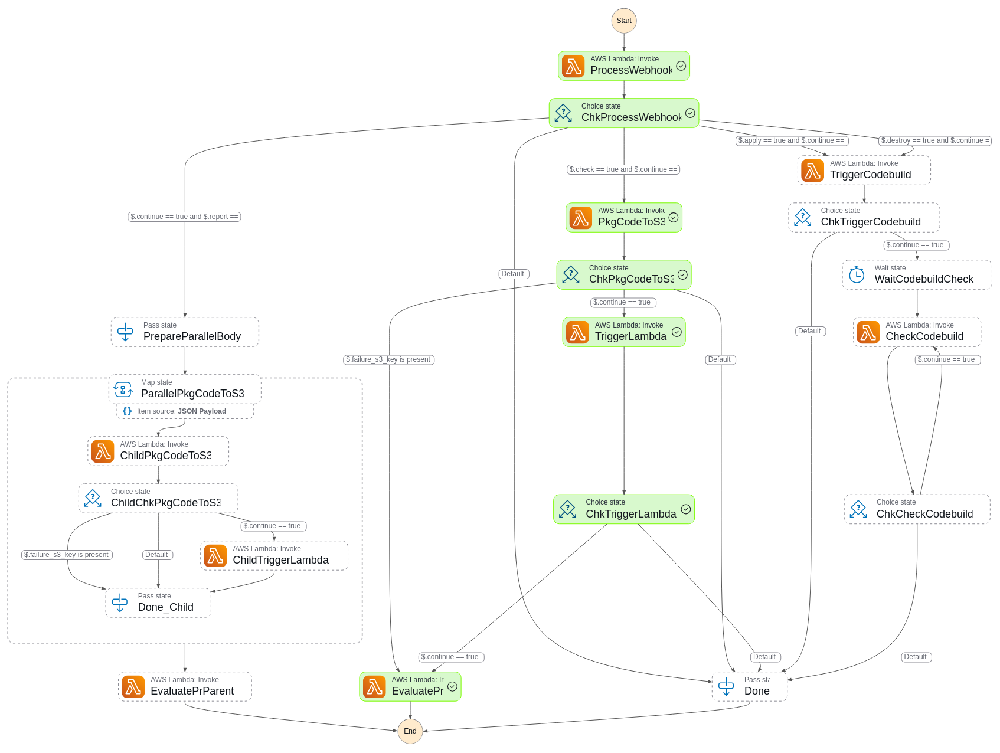

# What is "iac-ci"?

"iac-ci" is a standalone system built on AWS that provides continuous integration for Infrastructure as Code (IaC). It serves as an alternative to Atlantis, offering the following key benefits:

- **Open Source**: Fully belongs to the open-source community.
- **24/7 Availability**: Users can install it and have it running around the clock.
- **Cost-Effective**: Pay only for what you use.
- **No Scaling Concerns**: No need to manage and scale runners or workers.
- **No Third-Party API Gateway**: Eliminates the need for external services to manage APIs.

---

## How It Works

"iac-ci" system utilizes:

- **Two DynamoDB Tables**:
  - `iac-ci-settings`: Stores permanent configuration settings for each registered GitOps repository for IaC.
  - `iac-ci-runs`: A temporary table that records CI runs.

- **Lambda Functions**: Several Lambda functions are interconnected in a pipeline managed by a Step Function called `iac-ci-stepf-ci`.

- **API Gateway**: Acts as an entry point to receive webhooks.

### Executors

"iac-ci" relies on two types of executors:

1. **"iac-ci" Lambda Executor**: A Lambda function with elevated privileges to execute the IaC code.
2. **"iac-ci" CodeBuild Project Executor**: A CodeBuild project with elevated privileges to execute IaC apply/destroy operations.

---

## Step Function Workflow

The core of "iac-ci" is an AWS Step Function that orchestrates the entire workflow based on the type of request:


---

## Environment Variables for Build Configuration

Each IaC component directory (e.g., `vpc`) can include a `build_env_vars.env.enc` file that specifies runtime and build parameters. Below is an example configuration:

```env
TIMEOUT=600                         # Overall timeout (seconds)
BUILD_TIMEOUT=510                   # CodeBuild timeout (seconds)
TF_RUNTIME=tofu:1.9.1               # OpenTofu runtime version
AWS_DEFAULT_REGION=us-east-1        # AWS region
CODEBUILD_COMPUTE_TYPE=BUILD_GENERAL1_SMALL
CODEBUILD_IMAGE_TYPE=LINUX_CONTAINER
CODEBUILD_IMAGE=aws/codebuild/standard:4.0
APP_DIR=var/tmp/terraform           # Application working directory
APP_NAME=terraform                  # Name of the application
TMPDIR=/tmp                         # Temporary directory
IAC_CI_WAIT_DESTROY=180             # Seconds to wait before executing destroy
IAC_CI_WAIT_APPLY=180               # Seconds to wait before applying changes
ADD_SSM_NAMES=/config0-iac/tmp/cred.env # Additional SSM configurations
```

---

## Folder-Based Workflow

"iac-ci" supports a folder-based workflow that simplifies managing multiple IaC components within a single repository. Each directory must include a `.iac_ci/config.yaml` file to define its operations.

### Example Configuration Files

- **For a VPC component** (supports `apply` only):
  ```yaml
  # vpc/.iac_ci/config.yaml
  apply: true
  ```
  
- **For a development VM** (supports `apply` and `destroy`):
  ```yaml
  # dev-vm/.iac_ci/config.yaml
  apply: true
  destroy: true
  ```

### Workflow Auto-Detection

- **iac-ci** processes directories with:
  - A `.iac_ci/config.yaml` file.
  - Changes in the current pull request (PR).
  
- **Report All Command**: Runs checks on all directories with a `config.yaml`, regardless of changes.

---

## Key Features

1. **Single Entry Point**: Automates end-to-end developer solutions.
2. **Secure Workflows**: Ensures traceability, validation, and secure execution.
3. **Comprehensive Reporting**: Generates detailed reports for IaC workflows.

---

## Installation

To install "iac-ci," follow these steps:

1. **Via Config0**:
   - Sign up at [Config0](https://config0.com).
   - Execute two workflows to deploy the system.

2. **Manual Installation**:
   - Refer to the [manual installation guide](docs/INSTALL.md).
   - Complete prerequisites such as generating GitHub tokens and configuring Slack webhooks.

---

## Repository Management

### Registration Workflow


### Management Options

1. **Branch-Based Approach**: Each branch represents a separate IaC configuration.
2. **Folder-Based Approach**: Organize multiple IaC components in folders within a single branch.

---

## Commands Overview

1. **Checks/Preflight**:
   - `check tf`: Validates Terraform configurations.
   - `plan destroy tf`: Plans destruction.

2. **Actionable Items**:
   - `apply tf`: Applies changes.
   - `destroy tf`: Destroys infrastructure.

3. **Comprehensive Reporting**:
   - `report all tf`: Runs checks on all directories with `.iac_ci/config.yaml`.

---

## Screenshots

### AWS Console Examples

- **Apply Operation**  
  

- **Destroy Operation**  
  

- **Check Operation**  
  

### PR Comment Examples

- **Apply/Destroy Operation in PR**  
  

- **Check Operation in PR**  
  

---

"iac-ci" simplifies IaC workflows, reduces overhead, and integrates seamlessly into existing CI/CD pipelines. For more details, visit [Config0](https://config0.com).